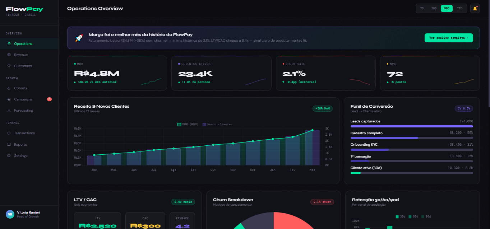

<div align="center">



<br>
<br>

<h1>FlowPay — Executive Operations Dashboard</h1>

<p>
Dashboard executivo inspirado em fintechs e plataformas SaaS modernas,
com foco em métricas estratégicas de crescimento, retenção e receita.
</p>

<p>


</p>

</div>

---

#  Sobre o Projeto

O **FlowPay Dashboard** foi desenvolvido para simular um ambiente analítico corporativo utilizado por fintechs modernas e empresas SaaS orientadas a métricas.

O projeto combina:

- Visual premium
- Storytelling com dados
- KPIs estratégicos
- Interface inspirada em produtos enterprise
- Experiência executiva para analytics

---

#  Métricas Monitoradas

<table>
<tr>
<td> MRR</td>
<td> Clientes Ativos</td>
<td> Churn Rate</td>
</tr>

<tr>
<td> NPS</td>
<td> LTV / CAC</td>
<td> Revenue Analytics</td>
</tr>

<tr>
<td> Cohort Analysis</td>
<td> Funnel Conversion</td>
<td> Live Transactions</td>
</tr>
</table>

---

#  Preview

<div align="center">


</div>

---

#  Funcionalidades

### Executive Overview
Painel estratégico consolidando indicadores de negócio.

### Revenue Analytics
Visualização da evolução de receita e aquisição de clientes.

### Conversion Funnel
Análise da jornada de conversão até clientes ativos.

### Cohort Retention
Heatmap de retenção mensal por coorte.

### Transaction Monitoring
Feed operacional simulando transações em tempo real.

### Retention Analytics
Comparação de retenção entre canais de aquisição.

---

#  Tecnologias

```txt
HTML5
CSS3
JavaScript
Chart.js
```

---

#  Estrutura do Projeto

```bash
flowpay-executive-dashboard/
│
├── index.html
├── preview.png
└── README.md
```

---

#  Como Executar

### Clone o repositório

```bash
git clone https://github.com/seu-usuario/flowpay-executive-dashboard.git
```

### Abra o projeto

```bash
index.html
```

Ou utilize a extensão **Live Server** no VS Code.

---

#  Objetivo

Este projeto foi desenvolvido como estudo de:

- dashboards corporativos
- visualização estratégica de dados
- interfaces SaaS
- analytics executivos
- experiência visual enterprise

---

#  Roadmap

- [ ] Backend em Python
- [ ] Integração com API
- [ ] Banco de dados
- [ ] Atualização em tempo real
- [ ] Deploy em nuvem
- [ ] Versão React
- [ ] Autenticação

---

#  Autor

<div align="center">

### Vitória Ranieri

Data • Analytics • Business Intelligence

</div>
